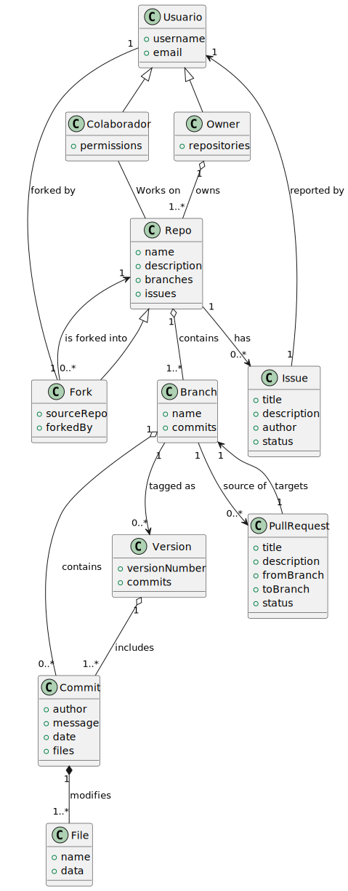
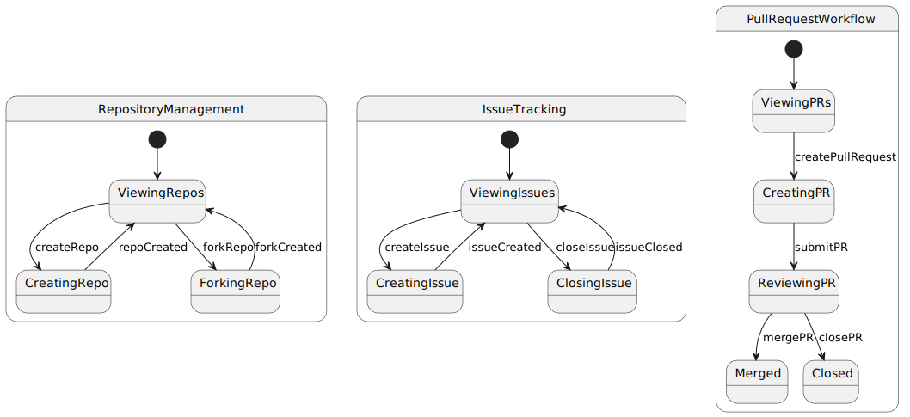

# Modelo del Dominio - Servidor de versionado de codigo (GitHub)

[Examen Parcial](documents/IdS-Parcial.pdf)

## Modelo del Dominio Original

### Diagrama de Clases
En este diagrama se presentan las clases base del sistema, incluyendo `Usuario`, `Repo`, `Fork`, `Issue`, `Branch`, `Commit`, y `File`. Las relaciones entre estas clases reflejan la estructura básica de un sistema de control de versiones.

### Diagrama de Objetos
Este diagrama muestra ejemplos concretos de instancias de los objetos definidos en el diagrama de clases, incluyendo un ejemplo de usuario (`owner`), repositorio (`repo`), y un archivo (`archivo`).

### Diagrama de Estados
El diagrama de estados muestra los flujos de trabajo principales del sistema, como la creación de un repositorio, push de cambios por un colaborador, y creación de forks y pull requests.

## Modelo del Dominio Iterado

### Diagrama de Clases
#### Mejoras realizadas:
- Se añadieron atributos a las clases (`username`, `email`, `permissions`), proporcionando mayor detalle.
- La clase `Fork` ahora hereda de `Repo`, indicando una especialización de repositorios.
- Nuevas relaciones entre clases (`Commit` ahora modifica `File`).
- Mejora en la descripción de atributos y métodos, haciendo el modelo más descriptivo.

### Diagrama de Objetos
#### Mejoras realizadas:
- Se añadieron nuevos objetos y atributos como `email` y `permissions` para usuarios.
- Mejora en la estructuración y ejemplos más detallados de datos.
- Relaciones adicionales como `PullRequest` vinculada a una rama específica (`masterBranch`).

### Diagrama de Estados
#### Mejoras realizadas:
- Separación en módulos claros: `RepositoryManagement`, `IssueTracking`, y `PullRequestWorkflow`.
- Añadidas nuevas transiciones (`createRepo`, `forkRepo`, `createPullRequest`).
- Mejora en la organización y claridad del flujo de trabajo.

## Imágenes de los Diagramas

### Modelo del Dominio Original

| Diagrama | Imagen |
|:--------:|:------:|
| **Diagrama de Clases** |  |
| **Diagrama de Objetos** |  |
| **Diagrama de Estados** |  |

### Modelo del Dominio Iterado

| Diagrama | Imagen |
|:--------:|:------:|
| **Diagrama de Clases:** | 
| **Diagrama de Objetos:** | 
| **Diagrama de Estados:** | 
